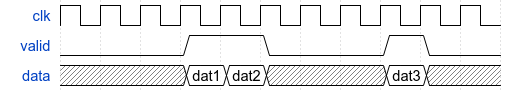
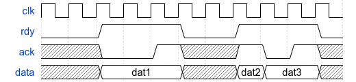

## Test with protocols

Nicotb provides wrapper for two common hardware interfaces,
and most submodules can be implemented by these twon interfaces.
Modern complex buses like AXI and Altera Avalon are also based on these protocols.

**Stream or 1-wire interface**.
A valid signal is used to indicate whether the bundled data is valid at this clock.



**Handshake or 2-wire interface**.
A rdy signal is used to indicate whether the bundled data is valid at this clock,
but an extra ack signal is used to hold the data until ack is asserted.
In AXI bus protocol, it is known as the ready/valid pair of both address and data channels.
Sometimes hardware designers might require ack to be de-asserted when rdy is de-asserted.



## The testbench

### Verilog part

To demonstrate the protocol based verfication, we use a simple module with two stream interfaces.
The input stream interface sends intergers into the module,
and the module calculates the sum of every 3 integers and outputs them.
For example, if you provide `[0,1,0,3,3,2,1,2,3]`, then you will get `[1,8,6]`.
The module I/O is shown below.

```verilog
module sm_dut(
    input clk, input rst,
    input i_dval, input [3:0] i,
    output o_dval, output [5:0] o
```

And our top-level testbench is:
```verilog
`timescale 1ns/1ns
`include "sm_dut.sv"
module sm;

logic clk, rst;
logic i_dval, o_dval;
`Pos(rst_out, rst);
`PosIf(ck_ev, clk, rst);

always #1 clk = ~clk;
initial begin
    clk = 0;
    rst = 1;
    #1 $NicotbInit();
    #10 rst = 0;
    #10 rst = 1;
    #1000
    $NicotbFinal;
    $finish;
end

sm_dut u_dut(.clk(clk), .rst(rst), .i_dval(i_dval), .i(), .o_dval(o_dval), .o());

endmodule
```

This is not very different from the [template](../examples.html),
while we don\'t use `WithFinish` macro so we cannot finish the simulation with `FinishSim()` in Python.

### Python part

In the Python part, first you must import the `OneWire` class to write testbench for stream interface.
We also import Numpy since Nicotb is based on that.
In the bottom lines, we create 4 buses with input/output valid/data signals and the reset/clock events.
You can find more documentation about this [here](../signals.html).

```python
from nicotb import *
from nicotb.protocol import OneWire
import numpy as np

N = 10

def main():
    # testbench here

src_val, dst_val, src_dat, dst_dat = CreateBuses([
    ("i_dval",),
    ("o_dval",),
    (("u_dut", "i"),),
    (("u_dut", "o"),),
])
ck_ev, rs_ev = CreateEvents(["ck_ev", "rst_out",])
RegisterCoroutines([
    main(),
])
```

After that, we need master to drive the input ports and a slave to observe the output ports.
This can be done after the first reset, maybe several cycles later.
We add a callback to print the data sent from the master or received from then slave.

```python
yield rs_ev
yield ck_ev
master = OneWire.Master(src_val, src_dat, ck_ev, callbacks=[print])
slave = OneWire.Slave(dst_val, dst_dat, ck_ev, callbacks=[print])
val = master.values
for i in range(3):
    val.value[:] = i
    # Note: the following 2 lines work the same
    # val.i[:] = i
    # val.values[0][:] = i
    yield from master.Send(val)
# Note: You can also use the iterator version
def it():
    val.value[:] = i
    yield val
yield from master.SendIter(it())
```

The `val = master.values` is the values of data bus.
Hence, it is exactly `src_dat.values`, that is, `src_dat.values is val` is evaluated to be `True`.
Also, you have to use `yield from` to *call* these sender functions (actually they are generators).

The simulation will print three `Bus` objects from `master` and one `Bus` object from `slave`.
For simplicity we provide utility classes:

* `BusGetter` to handle the `Bus` objects, check unknown values (`x` and `z`), and create a tuple of Numpy arrays.
* `Stacker` stacks multiple tuples of Numpy arrays got from `BusGetter`.
* `Scoreboard` is consisted of many `Test` objects, which can be created by `Scoreboard.GetTest()`.
* `Test` objects can compare the golden data from Python and the observed data from Verilog.

We can then chain the callbacks as `Slave -> BusGetter -> Stacker -> Test`,
and we finally get a tuple of stacked Numpy array(s), which is what we have to put in `Test.Expect`.

```python
scb = Scoreboard()
test1 = scb.GetTest("test1")
st = Stacker(N, callbacks=[test1.Get, lambda x: print("Print with name: {}".format(x.o))])
bg = BusGetter(callbacks=[st.Get])
yield rs_ev
yield ck_ev
...
slave = OneWire.Slave(dst_val, dst_dat, ck_ev, callbacks=[print, bg.Get])
# (N*3,) array
arr = np.random.randint(16, size=N*3, dtype=np.int32)
# (N*1,1) array
golden = np.sum(np.reshape(arr, (-1,3)), axis=1, keepdims=1, dtype=np.int32)
test1.Expect((golden,))
for i in arr:
    val.value[0] = i
    yield from master.Send(val)
# Wait 10 cycles
for i in range(10):
    yield ck_ev
# Do we receive extra data?
assert st.is_clean
```

You can find the complete source codes in `sum_every3/` directory, and similar example(s) are `counter/`.
You can run them by `make -f ../Makefile tb` or `make -f ../Makefile cnt`.
